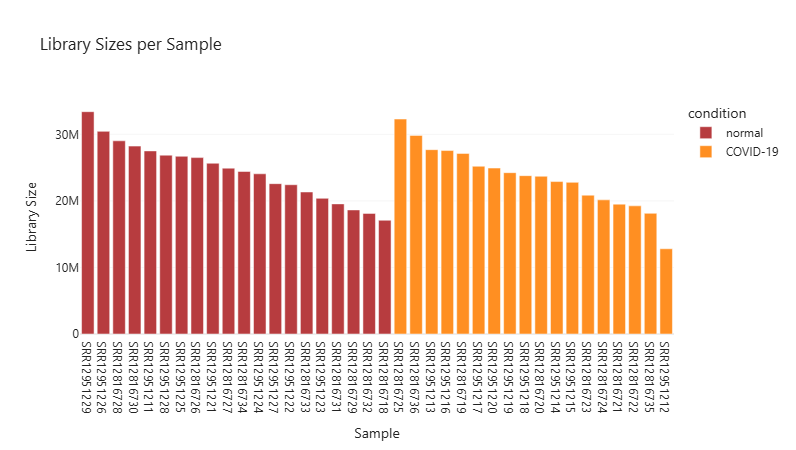
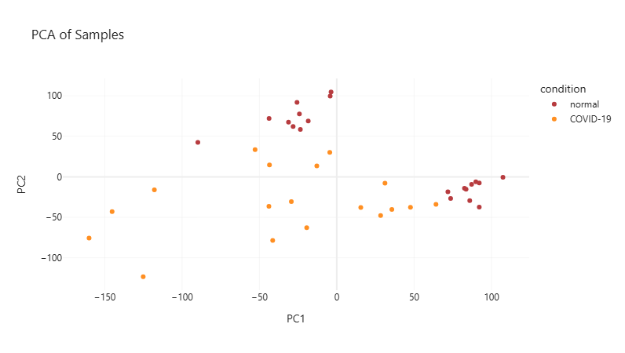
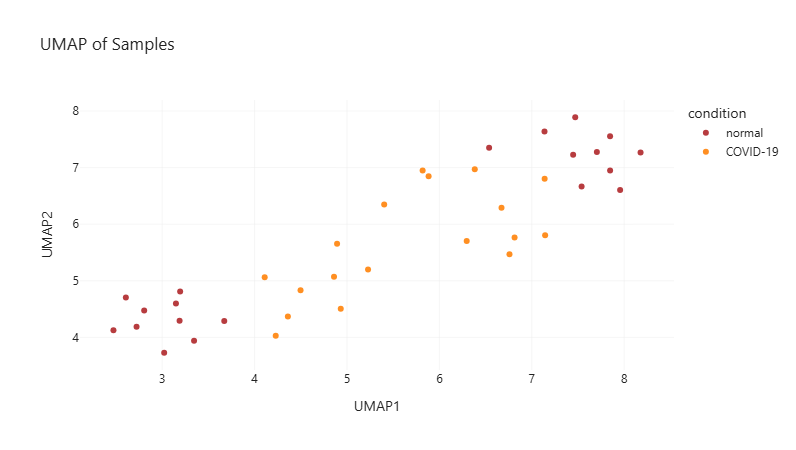
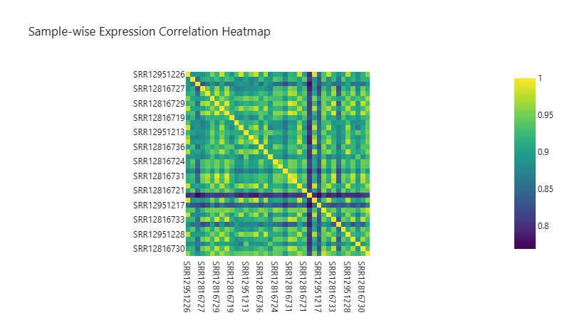
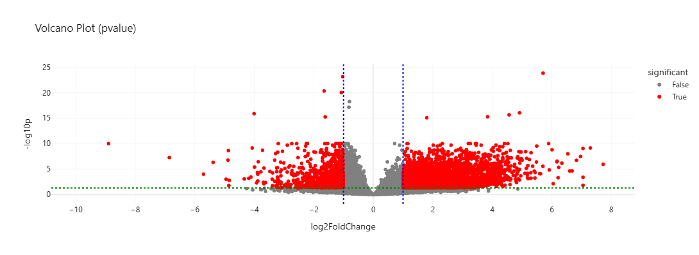
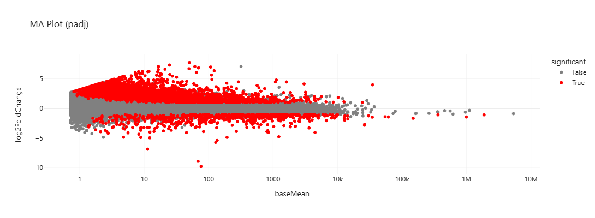
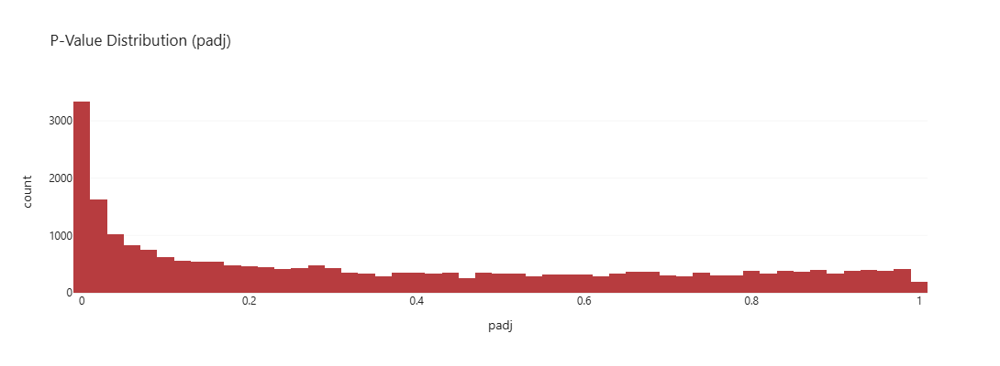

# Differential Gene Expression Analysis

Differential Gene Expression (DGE) analysis is a fundamental technique in transcriptomics that allows researchers to identify genes whose expression levels vary significantly between different biological conditions or experimental groups. For example, it helps pinpoint which genes are upregulated or downregulated in cancer tissues compared to healthy controls, offering valuable insights into disease mechanisms, biomarkers, and potential therapeutic targets.

At its core, DGE analysis answers the question: **“Which genes are behaving differently under specific conditions, and is that difference statistically significant?”** It quantifies gene expression using sequencing read counts and applies statistical models to determine whether observed differences are likely due to chance or reflect true biological variation.

Despite its accessibility, differential gene expression (DGE) analysis often requires programming expertise, creating a barrier for many biologists. This project introduces a **user-friendly, command-line tool** that enables researchers to perform DGE analysis and explore results through **rich, interactive visualizations**, all without writing a single line of code.


## Description

The tool consists of 2 different parts:

1. **Exploratory Data Analysis**  \
   The first step is to explore the raw count data. The tool performs *normalization* using **CPM** (counts per million). It then conducts dimensionality reduction and visualizes the results using **PCA** and **UMAP** plots to evaluate the similarity or dissimilarity between sample groups (e.g., patients with two different cancer types) as well as provides **correlation heatmap** and **sequencing sizes** for all samples in the data.

2. **Differential Gene Expression Analysis and Results Visualization** \
   The tool supports DGE analysis for datasets both with and without replicates (with a minimum of one sample per group). It utilizes the **pyDESeq2** library to fit a **generalized linear model (GLM)**, perform statistical testing, and calculate both raw and adjusted *p-values* (FDR correction).

   The analysis results are presented through a rich interactive dashboard that includes:

   - **Volcano plots** for visualizing significantly expressed genes
   - **MA plots** (mean expression vs. log2 fold change)
   - **P-Value distribution histograms** 

Together, these visual and statistical outputs empower researchers to generate hypotheses, validate biological findings, and prioritize targets for downstream experiments or clinical validation.

### User Input

1. **Count matrix file**  
   A CSV or TSV file containing gene count data.

2. **Group mapping file**  
   A CSV or TSV file specifying sample groups and factor levels.

   More information about the input formats can be found within the app.

3. Control and treatment groups should be specified when calling tool (see Usage section)

## Project architecture
```text
dge_pipeline/
├── README.md
├── app.py
├── config
│   ├── __init__.py
│   └── config.py
├── dge_pipeline
│   ├── __main__.py
│   ├── dashboard.py
│   ├── dge.py
│   └── main.py
├── eda_pipeline
│   ├── __init__.py
│   ├── __main__.py
│   ├── dashboard.py
│   ├── eda.py
│   ├── main.py
│   └── normalisation.py
├── pages
│   ├── dge.py
│   ├── eda.py
│   ├── main_page.py
│   └── upload.py
└── requirements.txt


```
## Features

- Upload gene count and design matrix files
- Normalize data with CPM (Counts Per Million)
- Visualize data using PCA and UMAP
- Run differential gene expression analysis using PyDESeq2
- Generate interactive volcano plots and result tables
- No coding experience required!


## Visuals

### Library Sizes per Sample  
This bar plot shows the **total number of sequencing reads** for each sample. It helps identify whether any samples have unusually low sequencing depth, which might affect normalization and downstream analysis.



---

### PCA of Samples  
**Principal Component Analysis (PCA)** reduces dimensionality of the data while preserving variation. It visualizes how samples cluster based on their gene expression profiles, helping assess batch effects, group separation (e.g., control vs. disease), or outliers.



---

### UMAP of Samples  
**UMAP** (Uniform Manifold Approximation and Projection) offers a non-linear alternative to PCA for visualizing high-dimensional structure. It often preserves local similarities better, helping to detect subtle patterns among samples.



---

### Sample-wise Expression Correlation Heatmap  
This heatmap shows the **pairwise correlation** of gene expression between all samples. Highly correlated groups suggest good biological replicates, while outliers or low correlation may point to technical issues.



---

### Volcano Plot  
A **volcano plot** visualizes the trade-off between **statistical significance (p-value)** and **biological effect size (log2 fold change)**. Red dots indicate genes that are both significantly and strongly differentially expressed between conditions.



---

### MA Plot   
This plot shows **log2 fold change** versus **average gene expression (baseMean)**. It highlights genes with strong differential expression and significant adjusted p-values, offering a complementary view to the volcano plot.



---

### P-Value Distribution  
The histogram displays the **distribution of adjusted p-values** across all genes. A left-skewed distribution indicates many truly differentially expressed genes, while a uniform distribution may suggest few or no significant differences.




## Installation
### Instalation from GitHub
```bash
# Clone the repository
git clone https://github.com/YOUR_USERNAME/dge_pipeline.git
cd dge_pipeline

# Create and activate a virtual environment (optional but recommended)
python3 -m venv venv
source venv/bin/activate

# Upgrade pip and install dependencies
pip install --upgrade pip
pip install -r requirements.txt

# Run the application
python app.py

```

### Instalation from Docker
To run this app using Docker, make sure Docker is installed and currently running on your machine. Then follow these steps:
```bash
# Clone the repository
git clone https://github.com/yourname/dge_pipeline.git
cd dge_pipeline

# Build Docker image using provided config files
docker build -t dge_pipeline_app .

# Run image
docker run -it --rm -p 8050:8050 dge_pipeline_app
```

## Support

If you encounter bugs, errors, or unexpected behavior while using the app:

- Please [open an issue](https://gitlab.gwdg.de/o.korchevaia/dge-analysis/-/issues) on this repository.
- For usage questions or feature suggestions, feel free to start a discussion or send a message via GitLab/GitHub.
- You may also contact the authors directly if your request is more specific.

## Work Process and Contributions

This project was developed collaboratively over several weeks as part of **Einführung in Python für Data Scientists**.

### Team Members and Contributions
**Olesia Korchevaia**  – [GitLab Profile](https://gitlab.gwdg.de/o.korchevaia) 
  - Dashboard interface structure
  - Created visualizations for results (volcano, MA, PCA, etc.)
  - Code modularization and Docker setup
  - Testing, bug fixing, and UI polish

**Irem Berna Güven**  [GitLab Profile](https://gitlab.gwdg.de/iremberna.gueven)
  - EDA pipeline implementation (PCA, UMAP, normalization)
  - DGE pipeline using PyDESeq2  
  - README writing, documentation, and visual outputs
  - Testing, bug fixing, and UI polish

### Timeline and Evolution

- **Week 1**: Tool concept design and literature review  
- **Week 2**: EDA component development and interface setup  
- **Week 3**: DGE pipeline integration and visualization testing  
- **Week 4**: Dockerization and cross-platform compatibility  
- **Week 5**: Documentation, example results, and final polish

## Acknowledgments

Special thanks to the open source community.

Resources and tools used in this project:

- [PyDESeq2](https://pydeseq2.readthedocs.io/en/latest/auto_examples/index.html) – Gene expression analysis  
- [Plotly](https://plotly.com/) – Interactive plotting  
- [Dash](https://dash.plotly.com/) – Visual dashboards  
- [ChatGPT](https://chatgpt.com/) – Debugging and help with visual presentation

## Project status

This project is currently **in active development**.

Core functionality is implemented and stable, including:

- Uploading input files
- Exploratory analysis with PCA/UMAP
- Differential gene expression analysis using pyDESeq2
- Interactive plots and downloadable results

Planned future improvements include:

- Improved error handling and feedback in the UI
- More flexible support for metadata and design matrices

We welcome your feedback and contributions as we continue to improve the app.


## Similar projects 
[Visit BigOmics RNA-Seq Tool](https://bigomics.ch/rna-seq-data-analysis)

